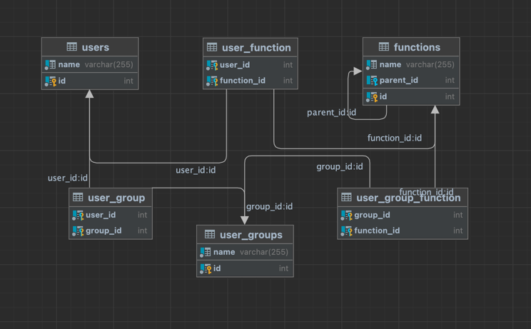

# Requirements
- Docker
- enter `docker` Directory
- copy `.env.dist` file to `.env` both files should be located in `docker` directory
- in your console run  `id $USER` to get your user **PUID** and **GUID**
- update   **PUID** and **GUID** in .env file

# Start
- To start application run command
  `make up` it will build and start docker container 
enter container using command `make app_bash`

# Prepare data
### Only Faker used as 3-rd party library to make test data creation easier 
- To fill database with fake data run `php DB\faker.php`

# Running
- To run script type `php app.php 'User Name' 'Function_name'`
  and it will return if User have Access to Function or Not

- to get full list of users with their allowed functions add third parameter 'list' to run command
like `php app.php 'User Name' 'Function_name' list`

For Function and Modules structure I used a "parent related" functions, so if Function doesn't
contain `parent_id` it is **Module** if contain - it is **Function**    
also permissions are stored in user_function and user_group_function tables this way we can add double sided
permissions so it doesn't matter which way we want to add permissions to Function or to user and to user_group   

  

# Task

Task evaluation criteria:
Task will be evaluated by these criteria (not in any particular order):
- Code quality and optimization. Let’s avoid unnecessary code and functionality.
- Simplicity and readability of solution. Let’s pretend this code needs to be supported by a large
team. Comments are welcome.
- General logic of solution. Task objective must work as described.
- How the problem was approached and how code is split and accessed. Show us your train of
thought.
Things
- The less calls to database, the better.
- We expect you to write all the code yourself. No usage of third-party libraries or code should be
to keep in mind: present in the project.
Task objective:
Write a script/program which can check whether a user can use the module or part of it.
Create a MySQL database structure that is able to maintain all necessary connections between users and module functions.
PHP function checking access must accept only two parameters: “Username” and “Function name” (both strings),
and return Boolean type response, with True meaning that access granted.
We expect to receive all necessary code of solution, and .sql file with database structure dump.
No design required; parameters can be "hardcoded" in a prominent place (e.g., front of index.php), or supplied through command line.
The main rules:
- Usernames for users are unique.
- Module function names are unique.
- The program is divided into modules (function groups).
- The module is divided into module parts (functions).
- Every user is assigned to one group. There can be an unlimited number of users in a group.
- Every function is assigned to one module. There can be an unlimited number of functions in the
module.
- There is an unlimited number of modules, module functions, user groups and users.
- Rights can be set to a group and inherited by all members in that group. Rights can also be set
directly to the user.
- Rights can be set for module, or module function (or both). Module access right, grants access
to all its functions.
Attached diagram to help visualize the rights distribution (as example).